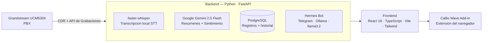

# MigraCRM

 
 
 
 
 

 

> **Plataforma CRM full-stack para call centers de firmas de inmigracion — con transcripcion automatica de llamadas, analisis de sentimiento y automatizacion con IA.**

> Este es un **portfolio showcase** — el codigo fuente es propietario y no esta incluido. Este README documenta la arquitectura y capacidades del sistema.

---

## El Problema

Las firmas de inmigracion que dependen de call centers enfrentaban:

- Sin registro automatico de llamadas — los agentes tomaban notas manualmente, perdiendo detalles criticos
- Sin historial de llamadas a mano — habia que buscar en planillas para reconocer a clientes recurrentes
- Sin resumenes con IA — supervisores no podian revisar rapidamente la calidad o resultado de las llamadas
- Sin seguimiento de sentimiento — sin visibilidad sobre frustracion o satisfaccion del cliente
- Telefonia desconectada — el PBX (Grandstream UCM) no tenia integracion con ningun CRM

---

## La Solucion

MigraCRM es un CRM construido a medida que se conecta directamente al PBX, transcribe automaticamente cada llamada, genera resumenes con IA y brinda a los agentes una vista 360° de cada cliente sin ningun ingreso manual de datos.

---

## Arquitectura

---

## Funcionalidades

| Funcionalidad | Descripcion |
|--------------|-------------|
| Transcripcion automatica | Cada llamada se transcribe con faster-whisper (inferencia local, sin API externa) |
| Resumenes con IA | Google Gemini 2.5 Flash genera resumen conciso y acciones sugeridas por llamada |
| Analisis de sentimiento | El tono emocional del cliente se clasifica por llamada y se rastrea en el tiempo |
| Registros CDR | Registros completos de detalle de llamada extraidos directamente del PBX |
| Historial del cliente | Historial completo de interacciones por cliente — llamadas anteriores, resumenes, notas |
| Notas del agente | Los agentes pueden agregar notas estructuradas y tareas de seguimiento |
| Estado del transcriptor en vivo | Indicador en tiempo real de cuando una llamada esta siendo transcrita |
| Bot Hermes | Asistente IA en Telegram (Ollama llama3.2) para consultas rapidas sobre datos de clientes |

---

## Stack Tecnologico

| Capa | Tecnologia |
|------|-----------|
| Backend | Python 3.12 · FastAPI · SQLAlchemy · SQLModel |
| IA / Voz | Google Gemini 2.5 Flash · faster-whisper (Whisper local) |
| Telefonia | Grandstream UCM6304 · CDR API · Recording API |
| Frontend | React 18 · TypeScript · Vite · Tailwind CSS |
| Base de datos | PostgreSQL |
| Bot | Telegram Bot API · Ollama · llama3.2 |
| Despliegue | VPS AlmaLinux bare-metal · PM2 · Nginx |

---

## Despliegue

MigraCRM corre en un **VPS bare-metal con AlmaLinux** con:
- **PM2** gestionando el backend FastAPI y el bot de Telegram como procesos persistentes
- **Nginx** como reverse proxy sirviendo el frontend React y redirigiendo solicitudes a la API
- **Callio Wave Add-in** instalado en los navegadores de los agentes para mostrar resumenes en tiempo real

---

## Capturas de Pantalla

> Capturas disponibles bajo solicitud — contactar para demo.

---

## Contacto

El codigo fuente es propietario. Para consultas sobre un sistema similar para tu empresa:

[pablozam1931@gmail.com](mailto:pablozam1931@gmail.com)

---

*Parte del portfolio [deadlyrat](https://github.com/deadlyrat) — ver tambien [Callio Wave Add-in](https://github.com/deadlyrat/callio-wave-showcase).*
