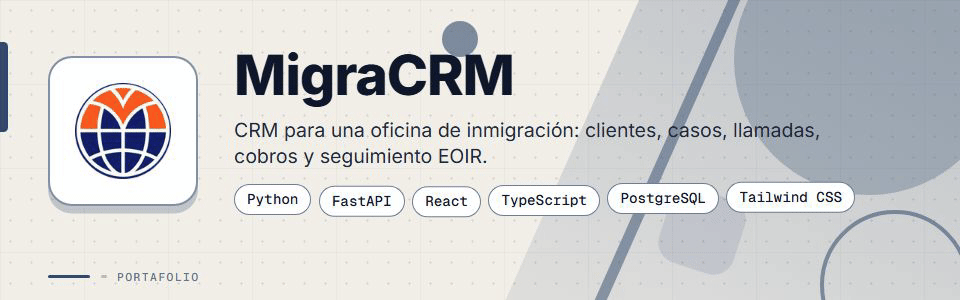
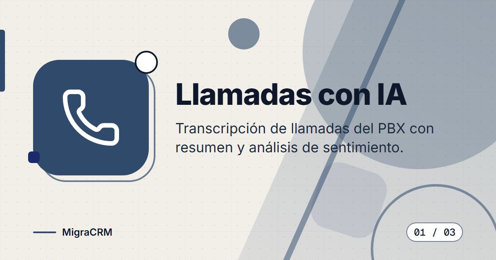
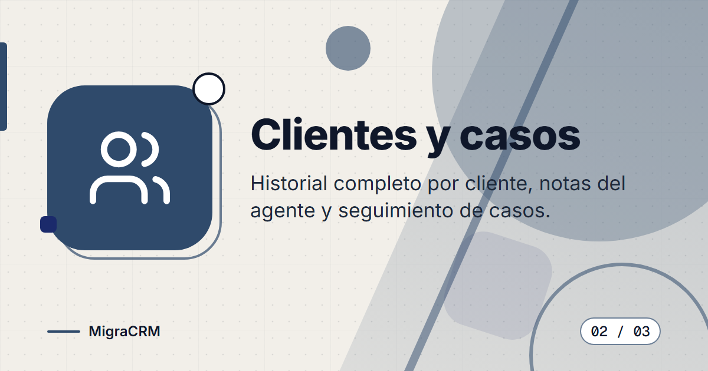
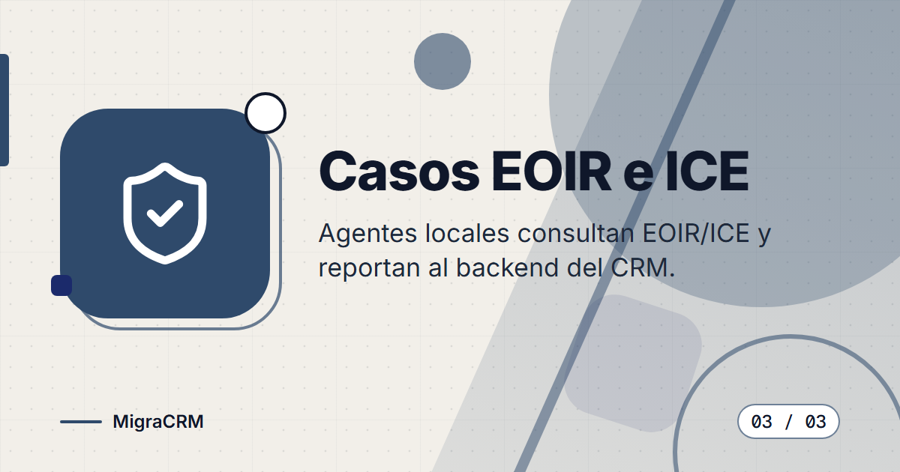
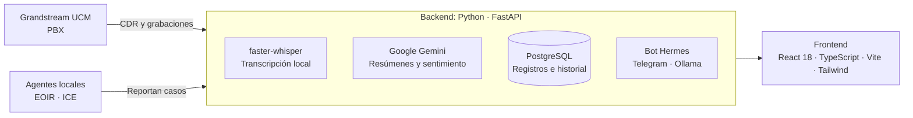

<div align="center">



# MigraCRM


**Plataforma CRM full-stack para una oficina de inmigración, con transcripción automática de llamadas del PBX, resúmenes con IA, análisis de sentimiento y seguimiento de casos EOIR e ICE.**

</div>

> Este es un **portafolio showcase**: el código fuente es propietario y no está incluido. Este README documenta la arquitectura y las capacidades del sistema.

---

## Contenido

- [El Problema](#el-problema)
- [La Solución](#la-solución)
- [Funcionalidades](#funcionalidades)
- [Vista Previa](#vista-previa)
- [Arquitectura](#arquitectura)
- [Stack Tecnológico](#stack-tecnológico)
- [Instalación local](#instalación-local)
- [Roadmap](#roadmap)
- [Contacto](#contacto)

---

## El Problema

Las firmas de inmigración que dependen de call centers enfrentaban:

- Sin registro automático de llamadas: los agentes tomaban notas a mano y se perdían detalles críticos.
- Sin historial a la mano: había que buscar en planillas para reconocer a los clientes recurrentes.
- Sin resúmenes con IA: los supervisores no podían revisar con rapidez la calidad o el resultado de las llamadas.
- Sin seguimiento del sentimiento: no había visibilidad sobre la frustración o la satisfacción del cliente.
- Telefonía desconectada: el PBX (Grandstream UCM) no tenía integración con ningún CRM.

---

## La Solución

MigraCRM es un CRM construido a medida que se conecta directamente al PBX, transcribe cada llamada, genera resúmenes con IA y le da al agente una vista completa de cada cliente sin ingreso manual de datos. Además centraliza clientes, casos, cobros y el seguimiento de detenidos y casos EOIR/ICE.

---

## Funcionalidades

| Funcionalidad | Descripción |
|---------------|-------------|
| Transcripción automática | Cada llamada se transcribe con faster-whisper (inferencia local, sin API externa) |
| Resúmenes con IA | Google Gemini genera un resumen conciso y acciones sugeridas por llamada |
| Análisis de sentimiento | El tono emocional del cliente se clasifica por llamada y se sigue en el tiempo |
| Registros CDR | Registros de detalle de llamada extraídos directamente del PBX |
| Historial del cliente | Interacciones por cliente: llamadas anteriores, resúmenes y notas |
| Notas del agente | Notas estructuradas y tareas de seguimiento |
| Estado del transcriptor en vivo | Indicador del avance de la transcripción de llamadas pendientes |
| Casos EOIR e ICE | Agentes locales consultan EOIR/ICE y reportan al backend del CRM |
| Cobros y detenidos | Módulos de cobros y de seguimiento de detenidos |
| Bot Hermes | Asistente en Telegram (Ollama) para consultas rápidas sobre datos de clientes |

---

## Vista Previa

<table>
  <tr>
    <td width="50%">
      
      <br><b>Llamadas con IA</b>: transcripción de llamadas del PBX con resumen y análisis de sentimiento.
    </td>
    <td width="50%">
      
      <br><b>Clientes y casos</b>: historial completo por cliente, notas del agente y seguimiento de casos.
    </td>
  </tr>
  <tr>
    <td width="50%">
      
      <br><b>Casos EOIR e ICE</b>: agentes locales consultan EOIR/ICE y reportan al backend del CRM.
    </td>
    <td width="50%"></td>
  </tr>
</table>

> Las capturas reales contienen datos de clientes, por eso este showcase solo muestra tarjetas ilustrativas.

---

## Arquitectura


```mermaid
graph LR
    PBX["Grandstream UCM<br/>PBX"] -->|"CDR y grabaciones"| BE

    subgraph BE ["Backend: Python · FastAPI"]
        W["faster-whisper<br/>Transcripción local"]
        G["Google Gemini<br/>Resúmenes y sentimiento"]
        DB[("PostgreSQL<br/>Registros e historial")]
        BOT["Bot Hermes<br/>Telegram · Ollama"]
    end

    AG["Agentes locales<br/>EOIR · ICE"] -->|"Reportan casos"| BE
    BE --> FE["Frontend<br/>React 18 · TypeScript · Vite · Tailwind"]
```

---

## Stack Tecnológico

| Capa | Tecnología |
|------|-----------|
| Backend | Python · FastAPI · SQLAlchemy |
| IA / Voz | Google Gemini · faster-whisper (Whisper local) |
| Telefonía | Grandstream UCM · CDR y grabaciones |
| Frontend | React 18 · TypeScript · Vite · Tailwind CSS |
| Base de datos | PostgreSQL |
| Bot | Telegram · Ollama |
| Despliegue | VPS Linux · PM2 · Nginx |

---

## Instalación local

> **Aviso:** el código es privado y propietario. Estos pasos son solo para colaboradores autorizados con acceso al repositorio.

1. Instala Python y Node.js.
2. Backend: instala las dependencias de `server_vps/requirements.txt` y configura tus propias variables de entorno.
3. Frontend:
   ```bash
   cd crm_frontend
   npm install
   npm run dev
   ```
4. Pruebas del backend: `python -m pytest` desde la raíz del proyecto.

---

## Roadmap

- [ ] Sumar capturas reales anonimizadas del sistema.
- [ ] Ampliar el análisis de sentimiento con tendencias por agente.

---

## Contacto

El código fuente es propietario. Para consultas sobre un sistema similar para tu empresa, escríbeme:

[](mailto:pablozam1931@gmail.com)
[%206517--1870-25D366?style=for-the-badge&logo=whatsapp&logoColor=white)](https://wa.me/50765171870)
[](https://github.com/deadlyrat)

- Correo: [pablozam1931@gmail.com](mailto:pablozam1931@gmail.com)
- WhatsApp: [(507) 6517-1870](https://wa.me/50765171870)
- GitHub: [github.com/deadlyrat](https://github.com/deadlyrat)

---

*Parte del portafolio de [deadlyrat](https://github.com/deadlyrat)*
